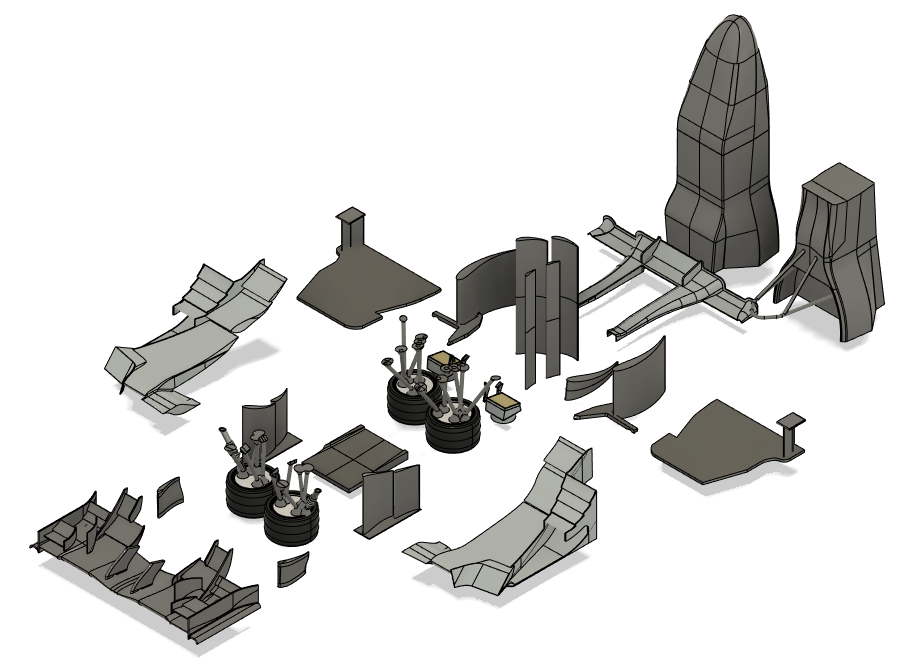

## What's this?
Always wanted to take DUT21 home, but Larry won't let you? Here, you'll find all the files needed to print your very own **1:10 scale model DUT21 car**! How exciting. You better make sure you like screaming when it breaks, cause this isn't perfect in the slightest. Buckle up if you're brave.

### Pretty pictures

[The scale doesn't come across like this, so here's a photo with my bed in the background](photos/scale.png). It's about the size of an A4 paper, but a bit less wide.

## The origin story

Ever since the DUT21 competition season, I've been thinking about making a 3D printable version of our amazing DUT21 car. Yet, me being me and having both not even a 3D printer and piss poor CAD skills , as well as being busy enough already, meant it would stay little more than a wish.

Yet still, as competition season again grew near the urge to have some tangible memory of my car never faded, until one fateful day I decided to splurge and buy a 3D printer. Problem one :white_check_mark: 

However, that still left me with another problem: one does not simply simplify a car with more parts than I can count, most of which smaller than would even show up when printed at a 1:10 scale. I wasn't all that keen on basically redrawing a simplified car from scratch (without e.g. all fasteners), but couldn't get the original car model to print (turns out inserts are annoying: they leave holes everywhere). Probably because to everyone's surprise, this car wasn't designed to be 3D printed but to `win FSG by maximising the downforce-to-weight ratio`.

Anyway, turns out that our lovely aero department had already worked their Catia magic and a simplified model existed for  CFD. Who knew. Problem two :white_check_mark:

Exporting all those as a `.step` file turned out to be a good choice, as you can actually easily edit those in any other software. Some press pulling in Fusion to bulk up some of the flimsy aero and suspension rods later, I'm happy to report I've got something that prints reasonably well, resulting in a bulk of PLA on my desk which is vaguely reminiscent of the actual car. 

## Make your own!
If you want your own, expect about ~30 hours of printing time and ~300g of filament, depending on your settings. Next, assembly will take quite a few hours as well, especially doing it for the first time (pro tip: drop it to get more practice!). If you want to paint it, add a few hours more and you're done!

### The files
The car is split up into a whole bunch of different prints to fit onto my Ender 3 pro. If you've got a big printer, I dare you to print it all in one go, but if not, splitting it up seems pretty smart, so that print orientations can be chosen to be not-entirely-dumb.

You'll find all the `.stl` files of the parts in this repo, as well as the fusion model in case you wanna work on that to fix everything I've done wrong. I've included a tiny stand for the right ride height (and to take the weight off the suspension) and the CFD Percy. 

### Printing
I dunno, but I used standard settings for 0.2mm layer height in Cura, except for lightning infill and tree supports where needed. Sometimes I added a brim to prevent warping. 

Orientation should be pretty self explanatory except for the chassis: print those with the glue interface down. Basically, choose a flat surface and put it on ya buildplate. 

I chose black PLA, not because that's convenient as it matches the carbon look, but because it's what I got with my printer.

#### Specs of mine
Printed in PLA
- Weight: 215 gram
- LxWxH: 29.4mm/15.9mm/11.9mm
- Printing time: dunno, I guess ~30h? 

### Painting
I used spray paints for the chassis and a bit of painting with a brush for blue highlights, red brake calipers and gray cooling fans. As a paint, I used gouache since I had that on hand, but you can probably use whatever. 
Don't forget a primer and take your time while masking off the chassis. For the blue color of the chassis, I used [RAL 5003 from Bauhaus](https://nl.bauhaus/spuitlak-gekleurd/dupli-color-color-lakspray-ral-5003-saffierblauw/p/15071694), cause that's what they had here in Delft.

I used some awesome competition photos as a reference for how to paint it, as well as [this picture of the wrap](photos/wrap.jpeg). I skipped the light blue on the chassis cause I'm lazy, but you do what floats your boat.

### Assembly
Just glue it with some super glue, but be smart with the order. Normal glueing tips apply, degrease a bit (or not, if you're brave) and apply ample pressure. For lining everything up, I mostly used the 3D model and did what looked right.

### Do's and don'ts 
- Don't be a dumbdumb like me and leave a black PLA chassis in the scorching sun while preparing for painting. PLA will warp like crazy, especially the hollow chassis. Maybe print it with a tiny bit of infill to prevent it from happening as severely as it did to me. 

- Don't be a dumbdumb like me and drop the whole thing, cause everything that can break will break.
- Don't use hot glue when something breaks. Hot glue is hotter than PLA likes, so warpie warpie -> everything's messed up.
- I thought I was pretty smart by printing the suspension rods with 100% infill. In Cura, and probably other slicers as well, you can set it to only use 100% infill in a certain area. Still broke when I dropped it, I tried my best. Might be smart to use for the roll hoop as well.
- Make sure to pay extra attention whether everything is straight and level when glueing things together.

## Things to fix still
- [x] Decals! Gonna get all the sponsors on it to make it look all nice and pretty. For the blue on white, clear waterslide decals seem to work well. I'm still looking for suggestions on how to make the white decals. HMU if you got ideas.
*Update 23/8/2022: I've uploaded the [decals](decals.png) which I've sent to be printed at https://www.printmetwit.nl/ . Will update once I've seen the results.*
- [ ] Fix that one annoying wing element on the front wing which is way too flimsy who even designed that thing.
- [ ] Fix the mounting of the cooling radiators. It just doesn't wanna glue right now
- [ ] Maybe add some tiny recesses in the chassis where stuff needs to be glued? Can help with adhesion and lining stuff up
- [ ] Add cables and cooling tubes. Thinking of using colored/painted filament, but that would mean 1.75mm always, which is a bit thicc.
- [ ] Play around with the size of the suspension triangles. Maybe thinner suspension rods?
- [ ] Add some more fillets to strengten parts.

## Get in touch
If you've got any questions, hit me up on Slack, I should probably see messages there. If not, my phone number can be found on there as well.

If you've made this, please please please send me photos, I would love for a lot of tiny DUT21's to exist. I still got loads of the right spraypaints left, so i can lend you some as well.

### License
I'm not sure what type of license to use for this, but feel free to remix, change or do whatever. If you're from another team and stumbled across this for some reason, maybe don't copy our entire aero package? Not that you would get many points in ED anyway. 